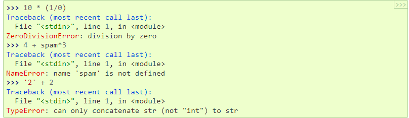
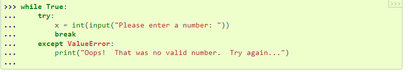
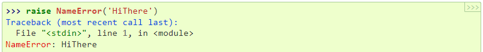
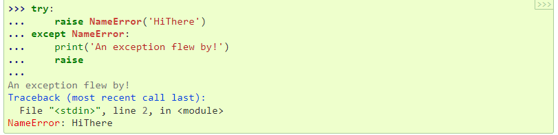
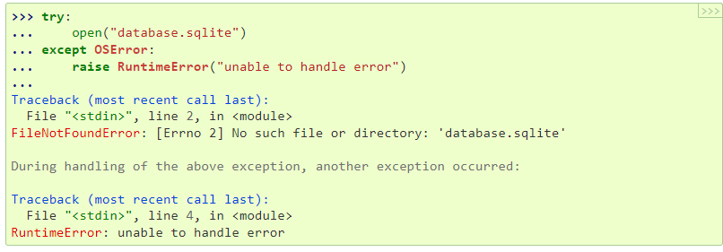
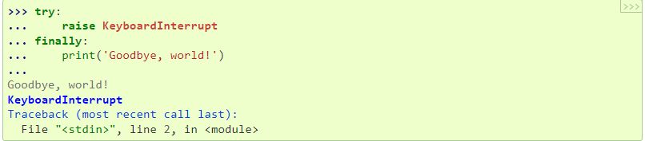
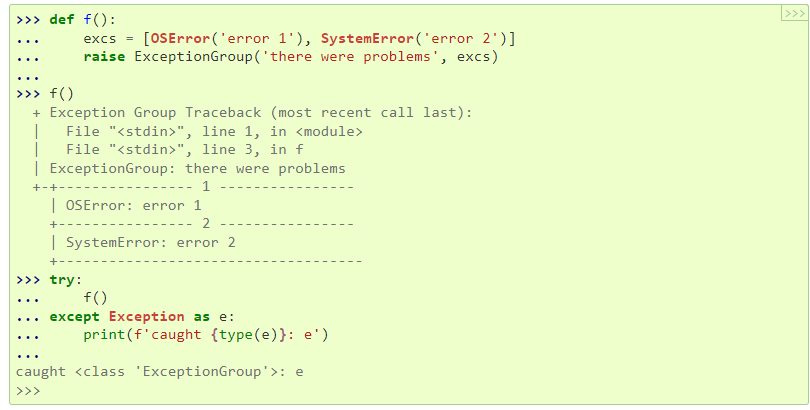
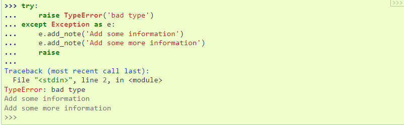

## BY AGBODO Yawo

## Master 1 Nov 2022

## Subject : Exception

## 1. introduction

An exception is an event, which occurs during the execution
of a program, that disrupts the normal flow of the program's instructions.
When an error occurs within a method, the method creates an object 
and hands it off to the runtime system.

## 2. présentation du concept
Exception handling is the process of responding to unwanted or unexpected events when a computer program runs. Exception handling deals with these events to avoid the program or system crashing, and without this process, exceptions
would disrupt the normal operation of a program.

## 3. théorie
Even if a statement or expression is syntactically 
correct, it may cause an error when an attempt is made to execute it. Errors detected during execution are called exceptions and are not unconditionally fatal: you will soon learn how to handle them in Python programs. Most exceptions are not handled by programs, however, 
and result in error messages as shown here:

+ Handling Exceptions
It is possible to write programs that handle 
selected exceptions. Look at the following example, which asks the user for input until a valid integer has been entered, but allows the user to interrupt the program (using Control-C or whatever the operating system supports); note that a user-generated interruption is signalled
by raising the KeyboardInterrupt exception.

+ Raising Exceptions
 The raise statement allows the programmer to 
force a specified exception to occur. For example:

If you need to determine whether an exception was raised but don’t intend to handle it, a simpler form of the raise 
statement allows you to re-raise the exception:

+ Exception Chaining
If an unhandled exception occurs inside an except section, it will have the exception being handled 
attached to it and included in the error message:

+ User-defined Exceptions
Programs may name their own exceptions by creating a new exception class (see Classes for more about Python classes). Exceptions should typically be derived from the Exception class, either directly or indirectly.
Exception classes can be defined which do anything any other class can do, but are usually kept simple, often only offering a number of attributes that allow information about the error to be extracted by handlers for the exception.
Most exceptions are defined with names that end in “Error”, similar to the naming of the standard exceptions.
Many standard modules define their own exceptions to report errors that may occur in functions they define.

+ Defining Clean-up Actions
The try statement has another optional clause which is intended to define clean-up actions that must 
be executed under all circumstances. For example:

If a finally clause is present, the finally clause will execute as the last task before the try statement completes. The finally clause runs whether or not the try statement produces an exception. The following points discuss more complex cases when an exception occurs:
If an exception occurs during execution of the try clause, the exception may be handled by an except clause. If the exception is not handled by an except clause, the exception is re-raised after the finally clause has been executed.
An exception could occur during execution of an except or else clause. Again, the exception is re-raised after the finally clause has been executed.
If the finally clause executes a break, continue or return statement, exceptions are not re-raised.
If the try statement reaches a break, continue or return statement, the finally clause will execute just prior to the break, continue or return statement’s execution.
If a finally clause includes a return statement, the returned value will be the one from the finally clause’s return statement, not the value from the try clause’s return statement.

+ Predefined Clean-up Actions
Some objects define standard clean-up actions to be undertaken when the object is no longer needed, regardless of whether or not the operation using the object succeeded or failed. Look at the following example, which tries to 
open a file and print its contents to the screen.

+ Raising and Handling Multiple Unrelated Exceptions
There are situations where it is necessary to report several exceptions that have occurred. This is often the case in concurrency frameworks, when several tasks may have failed in parallel, but there are also other use cases where it is desirable to continue execution and collect multiple errors rather than raise the first exception.
The builtin ExceptionGroup wraps a list of exception instances so that they can be raised together. It is an exception itself, so it can be caught like any other exception.

+ Enriching Exceptions with Notes
When an exception is created in order to be raised, it is usually initialized with information that describes the error that has occurred. There are cases where it is useful to add information after the exception was caught. For this purpose, exceptions have a method add_note(note) that accepts a string and adds it to the exception’s notes list. The standard traceback rendering includes all notes, 
in the order they were added, after the exception.

## 4. Conclusion
Finally, the exceptions are fundamental in programming.  
It exceptions make the code robust.
## 5. Ressources 

[faculty](https://faculty.ksu.edu.sa/sites/default/files/19-exceptionhandling.pdf)
